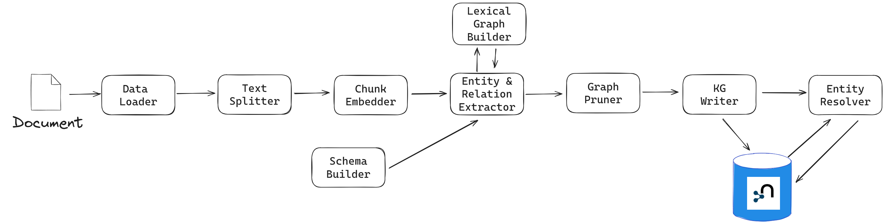

.. _user-guide-kg-builder:

User Guide: Knowledge Graph Builder
###################################

This page provides information about how to create a Knowledge Graph from
unstructured data.

.. warning::

    This feature is still experimental. API changes and bug fixes are expected.

******************
Pipeline Structure
******************

A Knowledge Graph (KG) construction pipeline requires a few components:

- **Document parser**: extract text from files (PDFs, ...).
- **Document chunker**: split the text into smaller pieces of text, manageable by the LLM context window (token limit).
- **Chunk embedder** (optional): compute the chunk embeddings.
- **Schema builder**: provide a schema to ground the LLM extracted entities and relations and obtain an easily navigable KG.
- **LexicalGraphBuilder**: build the lexical graph (Document, Chunk and their relationships) (optional).
- **Entity and relation extractor**: extract relevant entities and relations from the text.
- **Knowledge Graph writer**: save the identified entities and relations.
- **Entity resolver**: merge similar entities into a single node.

This package contains the interface and implementations for each of these components, which are detailed in the following sections.

To see an end-to-end example of a Knowledge Graph construction pipeline,
refer to the `example folder <https://github.com/neo4j/neo4j-graphrag-python/blob/main/examples/>`_ in the project GitHub repository.

**********************************
Knowledge Graph Builder Components
**********************************

Below is a list of the different components available in this package and how to use them.

Each of these components can be run individually:

.. code:: python

    import asyncio
    from neo4j_graphrag.experimental.components.pdf_loader import PdfLoader
    my_component = PdfLoader()
    asyncio.run(my_component.run("my_file.pdf"))

They can also be used within a pipeline:

.. code:: python

    from neo4j_graphrag.experimental.pipeline import Pipeline
    from neo4j_graphrag.experimental.components.pdf_loader import PdfLoader
    pipeline = Pipeline()
    my_component = PdfLoader()
    pipeline.add_component(my_component, "component_name")

Document Parser
===============

Document parsers start from a file path and return the text extracted from this file.

This package currently supports text extraction from PDFs:

.. code:: python

    from pathlib import Path
    from neo4j_graphrag.experimental.components.pdf_loader import PdfLoader

    loader = PdfLoader()
    await loader.run(path=Path("my_file.pdf"))

To implement your own loader, use the `DataLoader` interface:

.. code:: python

    from pathlib import Path
    from neo4j_graphrag.experimental.components.pdf_loader import DataLoader, PdfDocument

    class MyDataLoader(DataLoader):
        async def run(self, path: Path) -> PdfDocument:
            # process file in `path`
            return PdfDocument(text="text")

Document Splitter
=================

Document splitters, as the name indicate, split documents into smaller chunks
that can be processed within the LLM token limits:

.. code:: python

    from neo4j_graphrag.experimental.components.text_splitters.fixed_size_splitter import FixedSizeSplitter

    splitter = FixedSizeSplitter(chunk_size=4000, chunk_overlap=200)
    splitter.run(text="Hello World. Life is beautiful.")

Wrappers for LangChain and LlamaIndex text splitters are included in this package:

.. code:: python

    from langchain_text_splitters import CharacterTextSplitter
    from neo4j_graphrag.experimental.components.text_splitters.langchain import LangChainTextSplitterAdapter
    splitter = LangChainTextSplitterAdapter(
        CharacterTextSplitter(chunk_size=4000, chunk_overlap=200, separator=".")
    )
    await splitter.run(text="Hello World. Life is beautiful.")

Also see :ref:`langchaintextsplitteradapter` and :ref:`llamaindextextsplitteradapter`.

To implement a custom text splitter, the `TextSplitter` interface can be used:

.. code:: python

    from neo4j_graphrag.experimental.components.text_splitters.base import TextSplitter
    from neo4j_graphrag.experimental.components.types import TextChunks, TextChunk

    class MyTextSplitter(TextSplitter):

        def __init__(self, separator: str = ".") -> None:
            self.separator = separator

        async def run(self, text: str) -> TextChunks:
             return TextChunks(
                 chunks=[
                     TextChunk(text=text_chunk)
                     for text_chunk in text.split(self.separator)
                 ]
             )

Chunk Embedder
==============

In order to embed the chunks' texts (to be used in vector search RAG), one can use the
`TextChunkEmbedder` component, which rely on the :ref:`Embedder` interface.

Example usage:

.. code:: python

    from neo4j_graphrag.experimental.components.embedder import TextChunkEmbedder
    from neo4j_graphrag.embeddings.openai import OpenAIEmbeddings
    text_chunk_embedder = TextChunkEmbedder(embedder=OpenAIEmbeddings())
    await text_chunk_embedder.run(text_chunks=TextChunks(chunks=[TextChunk(text="my_text")]))

.. note::

    To use OpenAI (embedding or LLM), the `OPENAI_API_KEY` must be in the env vars, for instance using:

    .. code:: python

        import os
        os.environ["OPENAI_API_KEY"] = "sk-..."

If OpenAI is not an option, see :ref:`embedders` to learn how to use other supported embedders.

The embeddings are added to each chunk metadata, and will be saved as a Chunk node property in the graph if
`create_lexical_graph` is enabled in the `EntityRelationExtractor` (keep reading).

Lexical Graph Builder
=====================

Once the chunks are extracted and embedded (if required), a graph can be created. The lexical graph contains:

- `Document` node: represent the processed document and have a `path` property.
- `Chunk` nodes: represent the text chunks. They have a `text` property and, if computed, an `embedding` property.
- `NEXT_CHUNK` relationships between one chunk node and the next one in the document. It can be used to enhance the context in a RAG application.
- `FROM_DOCUMENT` relationship between each chunk and the document it was built from.

Example usage:

.. code:: python

    from neo4j_graphrag.experimental.pipeline.components.lexical_graph_builder import LexicalGraphBuilder
    from neo4j_graphrag.experimental.pipeline.components.types import LexicalGraphConfig

    lexical_graph_builder = LexicalGraphBuilder(config=LexicalGraphConfig(id_prefix="example"))
    graph = await lexical_graph_builder.run(
        text_chunks=TextChunks(chunks=[
            TextChunk(text="some text", index=0),
            TextChunk(text="some text", index=1),
        ]),
        document_info=DocumentInfo(path="my_document.pdf"),
    )

See :ref:`kg-writer-section` to learn how to write the resulting nodes and relationships to Neo4j.

Schema Builder
==============

The schema is used to try and ground the LLM to a list of possible entities and relations of interest.
So far, schema must be manually created by specifying:

- **Entities** the LLM should look for in the text, including their properties (name and type).
- **Relations** of interest between these entities, including the relation properties (name and type).
- **Triplets** to define the start (source) and end (target) entity types for each relation.

Here is a code block illustrating these concepts:

.. code:: python

    from neo4j_graphrag.experimental.components.schema import (
        SchemaBuilder,
        SchemaEntity,
        SchemaProperty,
        SchemaRelation,
    )

    schema_builder = SchemaBuilder()

    await schema_builder.run(
        entities=[
            SchemaEntity(
                label="Person",
                properties=[
                    SchemaProperty(name="name", type="STRING"),
                    SchemaProperty(name="place_of_birth", type="STRING"),
                    SchemaProperty(name="date_of_birth", type="DATE"),
                ],
            ),
            SchemaEntity(
                label="Organization",
                properties=[
                    SchemaProperty(name="name", type="STRING"),
                    SchemaProperty(name="country", type="STRING"),
                ],
            ),
        ],
        relations=[
            SchemaRelation(
                label="WORKED_ON",
            ),
            SchemaRelation(
                label="WORKED_FOR",
            ),
        ],
        possible_schema=[
            ("Person", "WORKED_ON", "Field"),
            ("Person", "WORKED_FOR", "Organization"),
        ],
    )

After validation, this schema is saved in a `SchemaConfig` object, whose dict representation is passed
to the LLM.

Entity and Relation Extractor
=============================

This component is responsible for extracting the relevant entities and relationships from each text chunk,
using the schema as guideline.

This package contains an LLM-based entity and relationships extractor: `LLMEntityRelationExtractor`.
It can be used in this way:

.. code:: python

    from neo4j_graphrag.experimental.components.entity_relation_extractor import (
        LLMEntityRelationExtractor,
    )
    from neo4j_graphrag.llm.openai import OpenAILLM

    extractor = LLMEntityRelationExtractor(
        llm=OpenAILLM(
            model_name="gpt-4o",
            model_params={
                "max_tokens": 1000,
                "response_format": {"type": "json_object"},
            },
        )
    )
    await extractor.run(chunks=TextChunks(chunks=[TextChunk(text="some text")]))

.. warning::

    The `LLMEntityRelationExtractor` works better if `"response_format": {"type": "json_object"}` is in the model parameters.

The LLM to use can be customized, the only constraint is that it obeys the :ref:`LLMInterface <llminterface>`.

Error Behaviour
---------------

By default, if the extraction fails for one chunk, it will be ignored and the non-failing chunks will be saved.
This behaviour can be changed by using the `on_error` flag in the `LLMEntityRelationExtractor` constructor:

.. code:: python

    from neo4j_graphrag.experimental.components.entity_relation_extractor import (
        LLMEntityRelationExtractor,
        OnError,
    )

    extractor = LLMEntityRelationExtractor(
        llm=OpenAILLM(
            model_name="gpt-4o",
            model_params={
                "max_tokens": 1000,
                "response_format": {"type": "json_object"},
            },
        ),
        on_error=OnError.RAISE,
    )

In this scenario, any failing chunk will make the whole pipeline fail (for all chunks), and no data
will be saved to Neo4j.

Lexical Graph
-------------

By default, the `LLMEntityRelationExtractor` also creates the lexical graph, adding a `FROM_CHUNK` relationship between any extracted entity and the chunk it has been identified into.

If this 'lexical graph' is not desired, set the `created_lexical_graph` to `False` in the extractor constructor:

.. code:: python

    extractor = LLMEntityRelationExtractor(
        llm=....,
        create_lexical_graph=False,
    )

.. note::

    If `self.create_lexical_graph` is set to `True`, the document and chunk nodes will be created.

    If `self.create_lexical_graph` is set to `False` but `lexical_graph_config` is provided, the document and chunk node won't be created but the relationship between the chunk and the entities extracted from it will still be added to the graph.

Customizing the Prompt
----------------------

The default prompt uses the :ref:`erextractiontemplate`. It is possible to provide a custom prompt as string:

.. code:: python

    extractor = LLMEntityRelationExtractor(
        llm=....,
        prompt="Extract entities from {text}",
    )

The following variables can be used in the prompt:

- `text` (str): the text to be analyzed (mandatory).
- `schema` (str): the graph schema to be used.
- `examples` (str): examples for few-shot learning.

Subclassing the EntityRelationExtractor
---------------------------------------

If more customization is needed, it is possible to subclass the `EntityRelationExtractor` interface:

.. code:: python

    from pydantic import validate_call
    from neo4j_graphrag.experimental.components.entity_relation_extractor import EntityRelationExtractor
    from neo4j_graphrag.experimental.components.schema import SchemaConfig
    from neo4j_graphrag.experimental.components.types import (
        Neo4jGraph,
        Neo4jNode,
        Neo4jRelationship,
        TextChunks,
    )

    class MyExtractor(EntityRelationExtractor):

        @validate_call
        async def run(self, chunks: TextChunks, **kwargs: Any) -> Neo4jGraph:
            return Neo4jGraph(
                nodes=[
                    Neo4jNode(id="0", label="Person", properties={"name": "A. Einstein"}),
                    Neo4jNode(id="1", label="Concept", properties={"name": "Theory of relativity"}),
                ],
                relationships=[
                    Neo4jRelationship(type="PROPOSED_BY", start_node_id="1", end_node_id="0", properties={"year": 1915})
                ],
            )

See :ref:`entityrelationextractor`.

.. _kg-writer-section:

Knowledge Graph Writer
======================

KG writer are used to save the results of the `EntityRelationExtractor`.
The main implementation is the `Neo4jWriter` that will write nodes and relationships
to a Neo4j database:

.. code:: python

    import neo4j
    from neo4j_graphrag.experimental.components.kg_writer import Neo4jWriter
    from neo4j_graphrag.experimental.components.types import Neo4jGraph

    with neo4j.GraphDatabase.driver(
        "bolt://localhost:7687", auth=("neo4j", "password")
    ) as driver:
        writer = Neo4jWriter(driver)
        graph = Neo4jGraph(nodes=[], relationships=[])
        await writer.run(graph)

To improve insert performances, it is possible to act on two parameters:

- `batch_size`: the number of nodes/relationships to be processed in each batch (default is 1000).
- `max_concurrency`: the max number of concurrent queries (default is 5).

See :ref:`neo4jgraph`.

It is possible to create a custom writer using the `KGWriter` interface:

.. code:: python

    import json
    from pydantic import validate_call
    from neo4j_graphrag.experimental.components.kg_writer import KGWriter

    class JsonWriter(KGWriter):

        def __init__(self, file_name: str) -> None:
            self.file_name = file_name

        @validate_call
        async def run(self, graph: Neo4jGraph) -> KGWriterModel:
            try:
                with open(self.file_name, "w") as f:
                    json.dump(graph.model_dump(), f, indent=2)
                return KGWriterModel(status="SUCCESS")
            except Exception:
                return KGWriterModel(status="FAILURE")

.. note::

    The `validate_call` decorator is required when the input parameter contain a `Pydantic` model.

See :ref:`kgwritermodel` and :ref:`kgwriter` in API reference.

Entity Resolver
===============

The KG Writer component creates new nodes for each identified entity
without making assumptions about entity similarity. The Entity Resolver
is responsible for refining the created knowledge graph by merging entity
nodes that represent the same real-world object.

In practice, this package implements a single resolver that merges nodes
with the same label and identical "name" property.

.. warning::

    The `SinglePropertyExactMatchResolver` **replaces** the nodes created by the KG writer.

It can be used like this:

.. code:: python

    from neo4j_graphrag.experimental.components.resolver import (
        SinglePropertyExactMatchResolver,
    )
    resolver = SinglePropertyExactMatchResolver(driver)
    res = await resolver.run()

.. warning::

    By default, all nodes with the __Entity__ label will be resolved.
    To exclude specific nodes, a filter_query can be added to the query.
    For example, if a `:Resolved` label has been applied to already resolved entities
    in the graph, these entities can be excluded with the following approach:

    .. code:: python

        from neo4j_graphrag.experimental.components.resolver import (
            SinglePropertyExactMatchResolver,
        )
        resolver = SinglePropertyExactMatchResolver(driver, filter_query="WHERE not entity:Resolved")
        res = await resolver.run()
